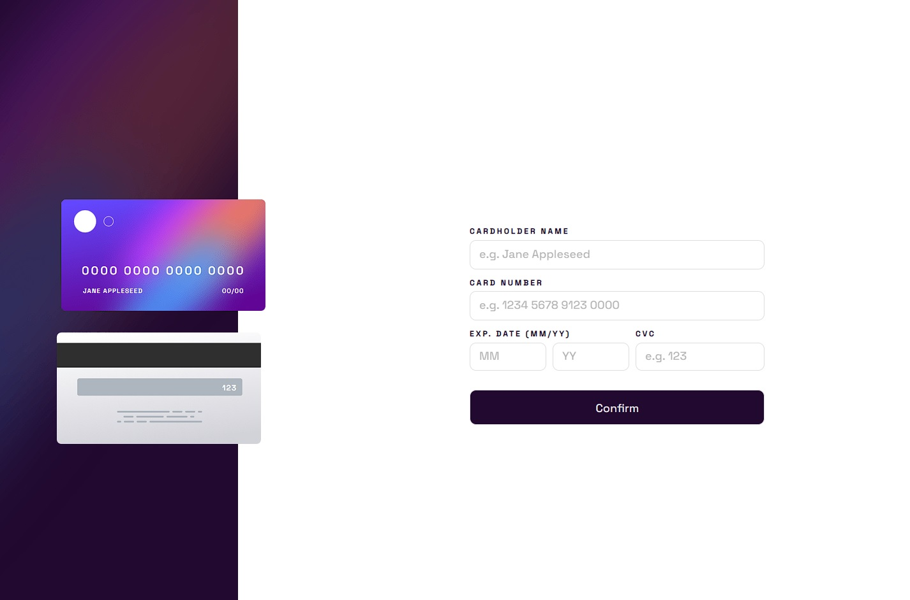

# Frontend Mentor - Interactive card details form solution

This is a solution to the [Interactive card details form challenge on Frontend Mentor](https://www.frontendmentor.io/challenges/interactive-card-details-form-XpS8cKZDWw). Frontend Mentor challenges help you improve your coding skills by building realistic projects. 

## Table of contents

- [Overview](#overview)
  - [The challenge](#the-challenge)
  - [Screenshot](#screenshot)
  - [Links](#links)
- [My process](#my-process)
  - [Built with](#built-with)
  - [What I learned](#what-i-learned)
  - [Continued development](#continued-development)
- [Author](#author)

**Note: Delete this note and update the table of contents based on what sections you keep.**

## Overview

### The challenge

Users should be able to:

- Fill in the form and see the card details update in real-time
- Receive error messages when the form is submitted if:
  - Any input field is empty
  - The card number, expiry date, or CVC fields are in the wrong format
- View the optimal layout depending on their device's screen size
- See hover, active, and focus states for interactive elements on the page

### Screenshot

### Links

- Solution URL: [Add solution URL here](https://your-solution-url.com)
- Live Site URL: [Add live site URL here](https://your-live-site-url.com)

## My process

This was a really difficult project for me. I've never done a credit card form using, and also using JavaScript Vanilla.
Stills being a really breakable and improvable app but I'm looking for advices and possible comments to implement better
practices on the build up of this project. But, it was really fun to think from scratch trying to not use any kind of help
from the Frontend Mentor forums.

### Built with

- Semantic HTML5 markup
- CSS custom properties
- Flexbox
- CSS Grid
- SASS (https://sass-lang.com/) - CSS Pre-processor
- Mobile-first workflow
- JavaScript ES6
- Gulp (https://gulpjs.com/) - Node.js Toolkit
- Node.js (https://nodejs.org/es/) - JavaScript Enviroment

**Note: These are just examples. Delete this note and replace the list above with your own choices**

### What I learned

During the build of this project I learned how to implement some good practices about validating the forms and how to implement
this functionalities to the app. Although, I have a really long way to go to improve this project and make myself comfortable doing
this kind of apps.

### Continued development

I want to use the things that I learned right here to improve my validating skills and my DOM Manipulation using JavaScript
without stopping too much on researching the right way of traversing the DOM, or calling some functions. Actually would be really good to know:

- How can I improve my Input Error Messages, on functionality and styles

## Author

- Website - [Roonder](https://github.com/Roonder)
- Frontend Mentor - [@roonder](https://www.frontendmentor.io/profile/Roonder)
- LinkedIn - [@roonderdev](https://www.linkedin.com/in/roonderdev/)